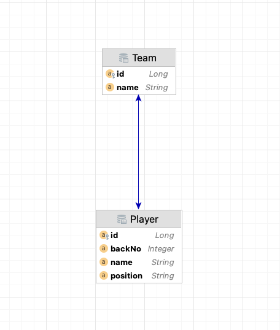
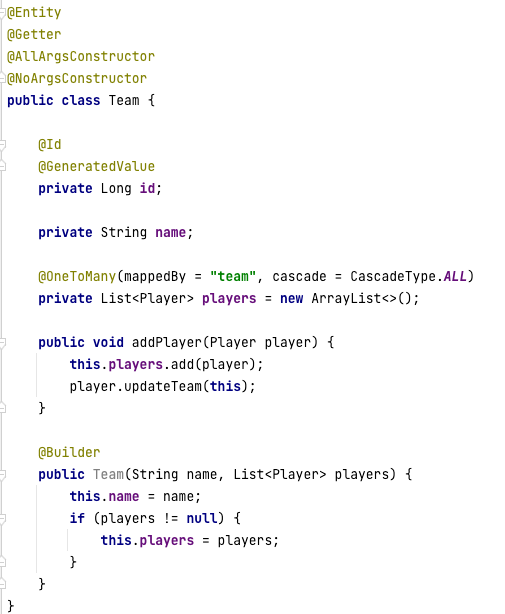
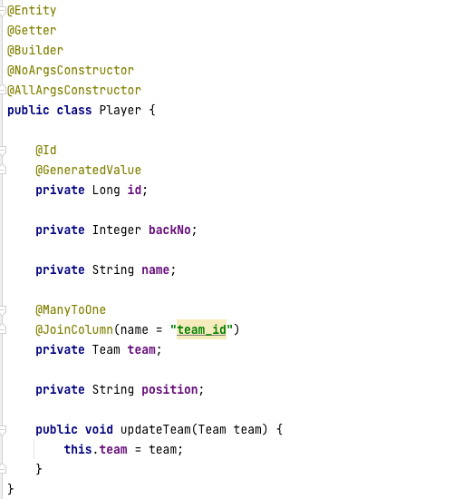
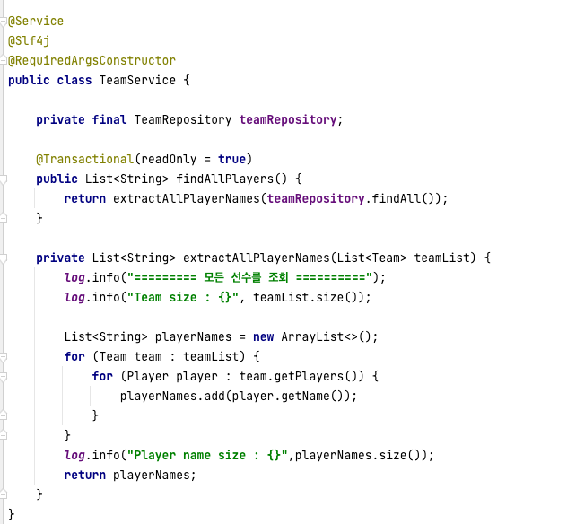
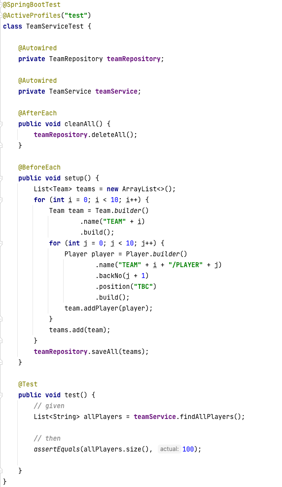
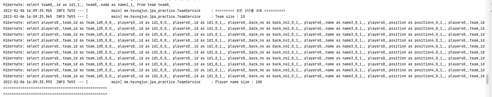
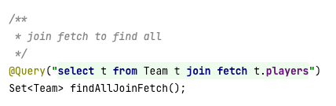
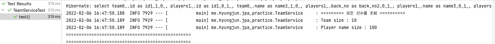
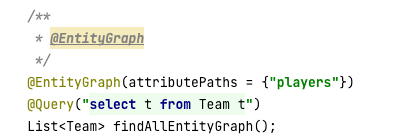
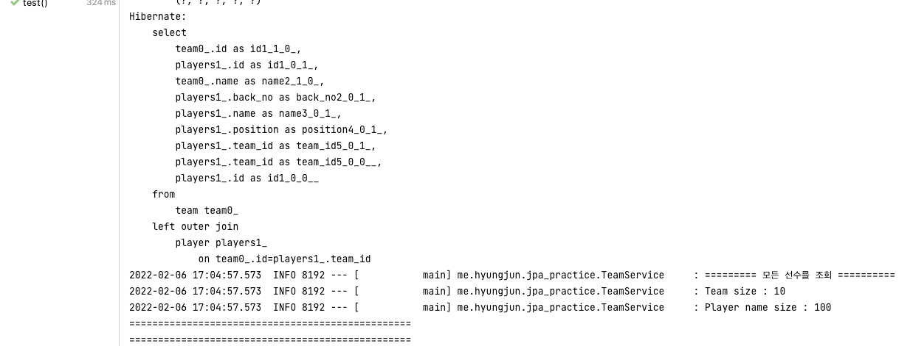

# JPA N+1 문제

자바 진영의 ORM 기술 표준인 JPA를 사용하면 한 번은 마주 할 수 있는 대표적인 성능 문제로 N+1에 대해 알아보겠습니다.

예를들어 축구팀이 있고 이 팀에 속하는 선수들이 여러명 있다고 가정해봅시다.

간단한 두 테이블을 다음과 같이 코드로 표현합니다.

위 테스트 코드는 10개의 팀이 존재하고 각 팀에는 10명의 선수가 포함되어 있습니다. 이 때 팀 서비스의 findAllPlayers 를 호출 한다면 어떤 쿼리가 생성되는지 확인해 보겠습니다.

보통 SQL 쿼리문을 작성한다면 두 연관 테이블의 join 문을 사용해서 하나의 쿼리를 만드려고 할 테지만, JPA에서는 위의 코드에서 다음과 같이 쿼리가 형성됩니다.

팀 전체를 조회하는 쿼리가 처음에 날아간 것을 볼 수있고, 그다음 하나의 팀에서 선수를 조회하는 쿼리가 10개 날아간 것을 볼 수 있습니다.

**(N+1) 문제라고 생각하면 됩니다.**
이런식으로 첫 쿼리 실행시에 원하는 정보를 모두 가져오지 않고, lazy loading으로 필요한 상황에서 다시 쿼리가 실행되어 전체 팀의 수인 N번 추가적으로 다시 발생하는 성능 이슈입니다.
만약 팀의 수가 많아지면 더 많은 db 조회를 해야 되기 때문에 상당히 비효율적인 것으로 판단할 수 있습니다.

이렇게 연관관계가 맺어진 하위 entity들을 한 번에 가져오는 방법을 몇가지 공부해 봅시다.

## Join fetch

가장 먼저 이를 해결할 수 있는 방법은 join fetch를 사용하는 것입니다.

처음에 SQL 쿼리문을 작성한다면 join문으로 하나의 쿼리를 날리고자 할 것입니다. JPA의 fetch join을 사용한다면 이런 최적화된 쿼리를 구현할 수 있을 것입니다. 

실제 로그를 확인하면,

위에서처럼 10개가 아닌 하나의 쿼리만 날아간 것을 볼 수 있습니다.

fetch join이 전부다 장점만 있는 것은 아닙니다.
하위 entity를 가져올 수 도 있고 fetch join을 사용하면 하위의 하위 entity 정보 역시 하나의 쿼리로 가져올 수 있는 장점이 있지만, FetchType을 설정해 놓은 코드가 무의미해질 수 있으며, Pagination 기능을 사용할 수 없는 점도 참고해야하는 단점입니다.

## @EntityGraph
@EntityGraph 애노테이션의 attributePaths에 쿼리 수행시 바로 가져올 필드명을 지정하면 해당 엔티티를 Eager 조인으로 가져오는 쿼리를 생성합니다.

로그를 보면 아래와 같습니다.

다만 join fetch 와 차이점은 join fetch 는 inner join, Entity Graph는 Outer Join 으로 쿼리문을 만들게 됩니다.

join fetch와 EntityGraph는 JPQL을 사용해서 join문을 사용하는 공통점으로 인해, **Cartesian Product**가 발생해서 Team의 수만큼 Player가 중복되거나 Player 수만큼 Team의 수가 중복되는 경우가 발생합니다.
따라서 Java 컬렉션에서 Set을 사용하여 중복을 허용하지 않는 자료형을 이용해서 이를 해결하거나 distinct 문을 사용해서 조회하도록 합니다.

추후에 QueryDSL을 공부한 후 추가적인 해결방법을 더 알아보겠습니다.

## 결론
N+1 은 JPA를 사용하면 연관관계를 가진 entity 간의 한번쯤 만나게된는 성능 이슈입니다. join fetch, @EntityGraph 와 같이 join을 이용해서 하나의 쿼리문을 생성시켜 해결하는 방법을 통해 이를 해결할 수 있지만 cartesian product로 인한 중복데이터 처리, fetchtype 설정 문제, pagination 등 함께 고려해야할 부분도 많습니다.

따라서 JPA만으로 실제 비즈니스 로직을 모두 구현하는건 반드시 한계가 있을 수 있다고 생각합니다. 간단한 로직은 JPA를 이용해서 성능 이슈 없이 프로젝트를 구현할 수 있겠지만 퍼포먼스의 난관은 불필요한 쿼리 제거, 쿼리빌더 등을 통해 고민하여 해결해야 합니다.

