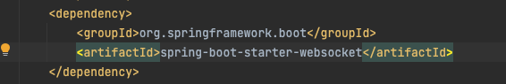
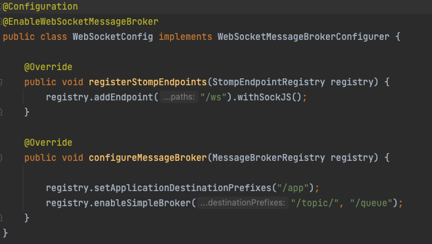
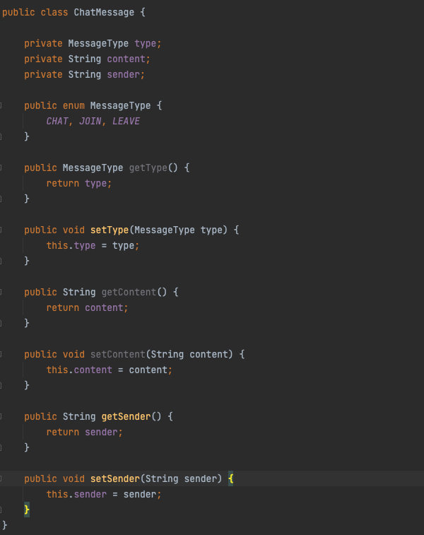
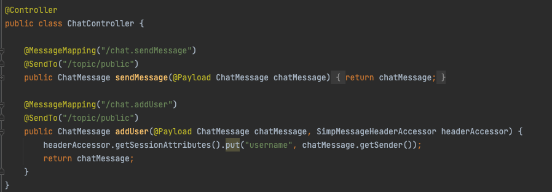
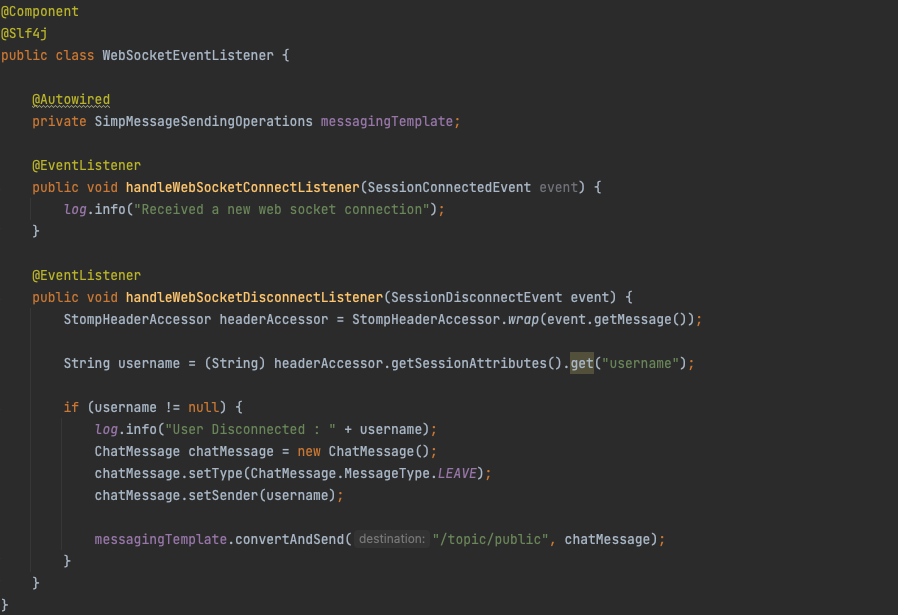
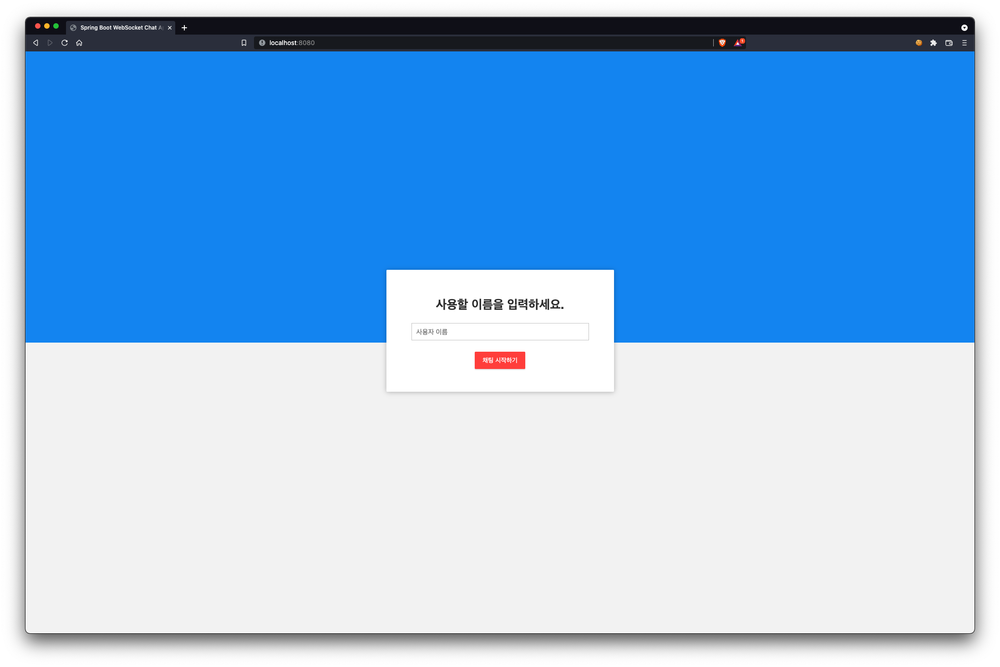
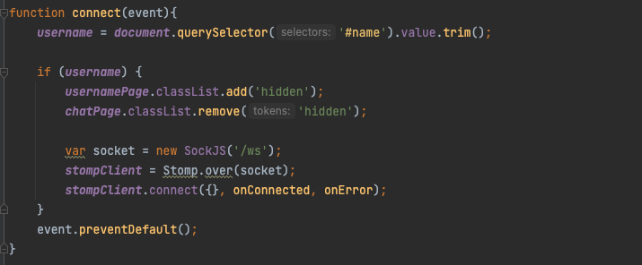

# Spring 과 WebSocket을 사용한 간단한 채팅 애플리케이션

웹소켓을 사용하여 간단한 채팅어플리케이션을 만들어보고, Spring에서 WebSocket API를 사용하는 방법을 공부하고 웹소켓 프로토콜 을 공부해 보겠습니다.

## 웹소켓이란
웹소켓이란 서버와 클라이언트 사이에서 two-way 커뮤니케이션 채널을 성공적으로 형성하도록 하는 통신 프로토콜입니다.

웹소켓은 처음에 서버와 일반적인 HTTP 연결을 형성하게고되고, 그 다음에 **Upgrade** 헤더를 보냄으로써 bi-directional한 웨소켓 연결을 서버와 형성하게 됩니다.

웹소켓은 현재 우리가 사용하는 최신 웹브라우저에서 모두 지원하고 있으며, 웹소켓을 지원하지 않는 오래된 브라우저와 같은 경우에는 comet 이나 long-polling 과 같은 기술을 사용해서 fallback을 지원하는 방법을 사용하게 됩니다.

## 웹소켓 설정하기 (**Spring**)

Spring 에서 웹소켓을 설정할 때 가장 먼저 해줘야하는 것은 웹소켓 의존성을 추가해줘야 합니다.

의존성관리 및 프로젝트 라이브러리 관리도구로 Maven을 사용하게 되면 위와 같이 설정해주명 됩니다.

그 다음으로 웹소켓의 endpoint와 메세지 브로커를 설정해줘야 합니다.
config 파일은 아래와 같이 만들도록 하겠습니다.

@EnableWebSocketMessageBroker 애노테이션은 @Configuration 이 붙은 클래스파일에 추가해주는 것이며, 웹소켓을 통해 brocker-backend 메세지 기능을 가능하게 하도록 하는 애노테이션입니다.

이 애노테이션의 자세한 내부 기능은 더 공부해서 추가하도록하고, WebSocketMessageBrockerConfigureer 인터페이스를 implement하여 설정을 커스터마이징 할 수 있습니다.

첫 번째 메소드에서 먼저 웻소켓의 endpoint를 등록하여 클라이언트가 서버 웹소켓 에 연결할 때 사용할 수 있게 합니다. withSockJS()가 붙여진 걸 볼 수 있는데, **SockJS**가 사용될 수 있도록 하는 것입니다. **SockJS**란 웹소켓을 지원하지 않는 브라우저에게 fallback 옵션이 사용될 수 있도록 해줍니다.

메소드이름이 그러나 Stomp endpoint라고 합니다. **STOMP**는 무엇인가 생각 할 수 있는데, Simple Text Oriented Messaging Protocol을 말하는데, 데이터를 주고 방을 때 어떤 규칙과 형식으로 주고 받을지 정의하는 메세징 프로토콜을 말합니다.

그럼 여기서 **STOMP**가 왜 사용되는가 하면, 웹소켓은 단지 커뮤니케이션 프로토콜을 말합니다. 웹소켓이라는 개념은 어떻게 특정 토픽을 구독(subscribe)하고 있는 특정 사용자에게 메세지를 전달할지, 아니면 특정유저에게 바로 메세지를 보낼지 등과 같은 기능을 정의하는 것이 아닙니다. 따라서 STOMP를 사용해야 하는 것입니다.

두 번째 메소드는 메세지 브로커를 설정해주는 것인데, 메세지 브로커를 통해서 메세지를 어디로 보낼지 설정해주는 기능을합니다.
첫 라인의 기능은 "/app" 으로 시작하는 목적지를 가지고있는 메세지는 메세지 핸들링 메소드로 라우팅 되도록 한다는 의미 입니다.
메세지 핸들링 메소든 뒤에서 다루도록 하겠습니다. 두번째 라인의 enableSimpleBroker 메소드의 기능은 "/topic" 으로 시작하는 목적지를 가진 메세지들은 메세지 브로커로 라우팅 되도록하는 것이고 메세지 브로커는 메세지들을 브로드캐스팅하여 웹소켓에 연결된 해당 토픽을 구독하고는있는 모든 사용자에게 메세지를 보내도록 합니다.
저 상태로 설정을 하게되면 스프링 인메모리로 메세지 브로커가 작동하게 되고, 더 많은 다양한 기능을 사용하기 위해 RabbitMQ나 ActiveMQ와 같은 메세지 브로커를 사용해도 됩니다.

## 메세지 페이로드(Payload) 모델
클라이언트와 서버사이에서 주고 받을 메세지 payload 모델을 하나 만들어 줍니다. 
클래스 이름은 ChatMessage라고 하겠습니다.

## 메세지를 주고 받을 컨트롤러

메세지를 다루는 컨트롤러를 만들겠습니다. 컨트롤러 내의 메소드들은 클라이언트로 부터 오는 메세지와 브로드 캐스팅으로 받는 메소드 모두를 성공적으로 받아오는 역할이 주된 책임(?)입니다. (클래스의 책임)

설정단계에서 해주었던 내용중에 destination endpoint가 '/app'인 메세지들은 메세지 핸들링 메소드로 라우팅 된다고 했습니다.
이때 메세지 핸들링 메소드임을 알 수 있도록 @MessageMapping 애노테이션을 넣어줍니다.
위의 예시를 보면 "/app/chat.sendMessage" 목적지를 가진 메세지는 모두 이 곳(sendMessage메소드)으로 다 오게됩니다.
마찬가지로 "/app/chat.addUser" 목적지를 가진 메세지는 모두 addUser메소드로 오게 됩니다.

## Event Listener 를 추가하기

이벤트 리스너를 사용하여 사용자가 소켓에 연결되고 연결을 끊을 때를 감지하여 로그를 남길 수 있도록 하겠습니다. 또한 이 상황을 감지하여 다른 사용자들에게 특정 사용자가 연결을 했는지 연결을 끊었는지 알 수 있도록 브로드케스팅 메세지를 보내도록 하겠습니다.

새로운 사용자가 추가되는 경우는 메세지 핸들링 메소드로부터 받아오니 웹소켓 세션 연결이 종료될때 세션에서 사용자의 이름을 가져오고 해당 사용자가 연결이 종료되었음을 브로드캐스팅 하는 내용을 handleWebSocketDisconnectListener 에서 해줍니다.

## Front-End 구현

아주간단한 화면을 구성하도록 하겠습니다.
html, css, JS 코드 내용은 자세히 설명하지 않고 코드링크를 통홰 확인하도록 하겠습니다.

먼저 index.html 파일에는 sockjs와 stomp javascript 라이브러리를 추가해 줘야 합니다.
SockJS는 웹소켓 클라이언트가 네이티브 웹소켓을 사용하게 해주고 오래된 브라우저로부터 fallback옵션들을 제공해줍니다.

Javascript 코드에 있는 핵심적인 내용을 보겠습니다.

connect() 함수는 SockJS와 stomp 클라이언트를 사용해서 서버에서 설정해 놓은 '/ws' 엔드포인트에 연결을 하는 함수 입니다.

연결이 성공적으로 이루어 졌다면, 클라이언트측은 '/topic/public' 이라는 위치로 subscribe를 하게 됩니다. subscribe 해놓은 곳으로 다른 유저가 메세지를 보낸다면 바로 받아볼 수 있게 되는 것입니다. 

또 연결이 되었기 때문에 서버에 메세지를 보내는데 그 위치는 서버에 설정해둔 목적지인 '/app/chat.addUser' 입니다.
메세지 핸들링 메소드들은 메세지를 다시 보내는 곳이 사용자들이 구독하는 위치인 '/topic/public'이기 때문에 이곳으로 메세지들을 콜백함수로부터 받아와 볼 수 있게 된느 구조입니다.
